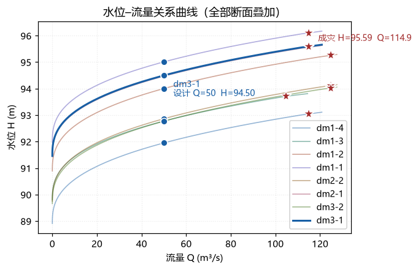
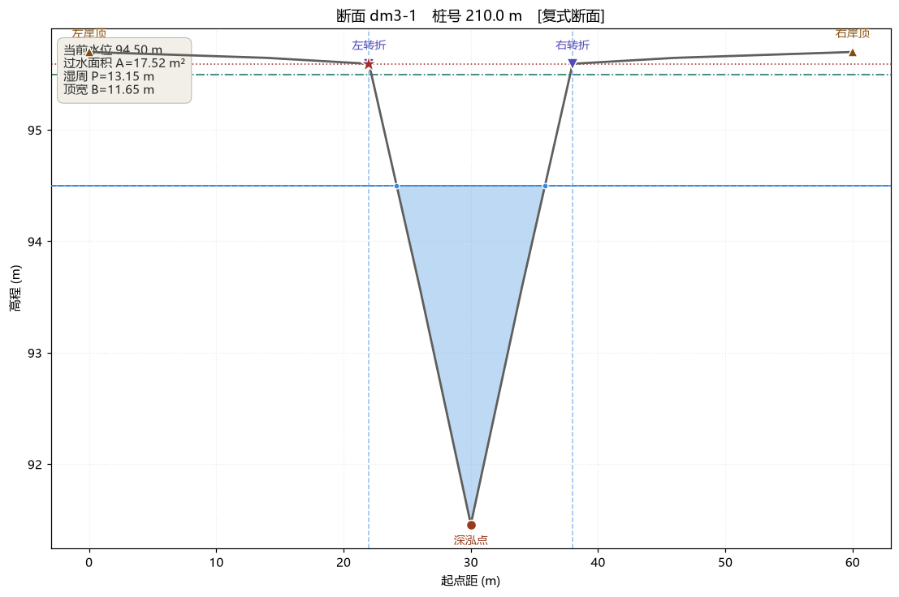
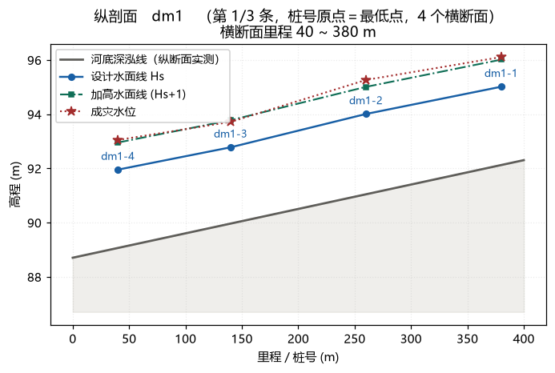

# 河道断面水位–流量关系计算工具

河道横断面测量的**水位–流量关系曲线**（rating curve）计算与出图工具，Windows 桌面程序。

给它一批横断面实测数据（起点距 / 高程 / 平面坐标），程序按断面形态**自动分区**
（左滩 / 主槽 / 右滩），逐级水位算出过水面积 A、湿周 P、水力半径 R 与流量 Q，
得到水位–流量关系；也支持按纵断面推算比降、在图上手动指定深泓点 / 分区边界 / 成灾水位。
结果导出 CSV / Excel，并出三类图。

由原 MATLAB 计算脚本重写而来，**计算逻辑与原实现保持一致**
（与 MATLAB 的差异见 `DESIGN.md` 第三节）。
原 MATLAB 脚本属历史参考资料，不随仓库分发。



| | |
|---|---|
| 界面 | Python 3.13 + PySide6（Qt）6.11 |
| 绘图 | matplotlib，嵌进 Qt 窗口 |
| 计算层 | `src/core/` **纯标准库**（仅 `reader.py` / `exporter.py` 读写出 xlsx 用到 openpyxl），可脱离界面单独测试 |
| 分发 | PyInstaller 打包成单个 exe（约 152 MB），目标机器无需装 Python |
| 测试 | 153 个单元测试（其中 150 个纯标准库可跑）+ 界面冒烟测试 + 打包后自检 |

## 环境准备（第一次跑）

需要 **Python 3.13（64 位）**——离线 wheel 都是 `cp313` 标签，3.12 装不上。

依赖约 108 MB，**不在仓库里**（会把 `.git` 撑到 100 MB 量级），按清单取回：

```bat
:: 1. 建虚拟环境
python -m venv .venv

:: 2. 取回依赖：读 wheels_urls.txt，21 个 wheel；可重复跑，已下好的会跳过
.venv\Scripts\python.exe tools\fetch_wheels.py

:: 3. 离线安装（不联网、不碰全局）
.venv\Scripts\python.exe -m pip install --no-index --find-links wheels -r requirements.txt
```

## 快速开始

```bat
:: 启动界面
.venv\Scripts\python.exe src\app\main.py

:: 或命令行批处理，不开界面
.venv\Scripts\python.exe tools\run_batch.py
```

界面里：**载入数据目录 → 调参数 → 保存工程 → 看图 / 导出**。

**数据要自备。** 真实测量数据不随仓库分发，但仓库带了一份**合成**的示范数据
（`samples/demo_data/`，3 条纵断面线 / 8 个横断面），**开箱即可跑通全流程**；
换成自己的数据，把 xlsx 放进 `data\`，或在界面里「文件 → 载入数据目录」。

> ⚠ **参数集不提供。** 程序会用占位值（糙率 0.03 / 比降 0.005 / 设计流量 50）填补，
> 跑通流程没问题，但**实际计算必须换成真实参数**。

## 三类输出图

**断面形态**——自动识别深泓点与左右转折点，按转折点分区（浅蓝为淹没面积）：



**水位–流量曲线**——逐断面曲线，标注设计流量与成灾水位：


**沿河纵剖面**——河底深泓线、设计水面线、加高水面线、成灾水位：



配图由 `tools/gui_smoke.py` 用示范数据离屏渲染（输出在 `output\_preview\`），可随时重新生成。

## 界面

顶部菜单栏：

| 菜单 | 内容 |
|---|---|
| **文件** | 新建工程 / 打开工程 / 保存 / 另存为 / 载入数据目录 / 导出结果 / 退出 |
| **编辑** | 编辑当前横断面：拖动改高程 / 起点距，表格键入或**从 Excel 粘贴**，增删测点（新窗口，左表格 + 右可拖动断面图） |
| **计算设置** | 断面模式、水位步长、桩号原点、陡坡·缓坡阈值、**坐标列序**、**加高水位（幅度 + 是否绘制）**、CSV 编码 |
| **批量填写** | 把一组糙率 / 比降 / 设计流量套用到全部断面 |
| **按纵断面推算比降** | 用纵断面实测数据推算各断面比降 |
| **一维水面线推算** | 对选定的纵断面线执行一维恒定流水面线推算（支持缓流、急流），推算结果显示在纵剖面图上 |
| **分区调节** | 手动指定深泓点与分区边界（在断面图上拾取实测测点） |
| **成灾水位** | 手动指定成灾水位（同上，图上拾取） |
| **帮助** | 关于：版本号 + 构建哈希 + 构建时间，可整段复制 |

除「文件」「帮助」外，其余菜单项都是**点开即用的非模态面板**
（点一下直接弹面板，不是下拉菜单）。

## 版本与构建信息

标题栏显示版本号（如 `v1.2.3`），**帮助 → 关于** 显示完整信息 + **版本历史** + 签名，
可选中、可一键复制：

```
河道断面水位–流量关系计算工具
版本：1.2.3
构建：920af29
构建时间：2026-09-25 16:18
运行方式：打包程序（exe）

版本历史
v1.2.3　（2026-09-25）
  · 修复：没有数据时运行自检（--selftest）会永久卡死且没有任何输出，
    现在改为给出明确提示，并可指定数据目录
  · 自检与界面冒烟测试在没有 data/ 时回退到自带的示范数据（samples/demo_data）
  …

签名：Yellow
```

- **版本号**遵循语义化版本：修 bug → 修订号 +1，新增功能 → 次版本 +1
- **版本历史**只列**用户能感知到**的改动（内部重构、测试补充不进这张表）
- **构建哈希**是打包那一刻的 git 提交短哈希——同一个版本号会被反复打包，
  **靠它才能唯一定位到具体是哪一次**，所以它和版本号一样重要

**反馈问题时，请把上面这一整段贴过来。**

> 维护这些内容（怎么改、发版要注意什么、哪些测试会挡住漏写）
> 见 `CLAUDE.md`「版本、构建信息与签名」。

## 工程文件（.dmprj）

调好的参数不必每次重填——「文件 → 保存 / 另存为」存成工程文件，
下次「文件 → 打开工程」即可完整还原。

**它保存的是全量快照，打开时不依赖原始 xlsx：**

| 内容 | 说明 |
|---|---|
| 纵断面线 | 名称、断面顺序、里程、各断面在纵断面上的位置 |
| 纵剖面实测数据 | 起点距 + 河底高程（画纵剖面、推算比降都要用） |
| 横断面几何 | 每个断面的 X / Y / 起点距 / 高程四列 |
| 断面参数 | 比降、糙率、设计流量、主槽/左滩/右滩分区糙率 |
| 手动设定 | 深泓点、分区边界、成灾水位的人工覆盖值（v2 起） |
| 计算设置 | 全部设置项（断面模式、dH、桩号原点、两个阈值、坐标列序、CSV 编码…） |
| 数据来源 | 原始目录与文件名，**仅作记录**，打开时不读取 |

**格式**：单个 JSON 文本（UTF-8 带 BOM），能用记事本直接查看、甚至手改参数。
**不保存计算结果**——打开时一律重算，所以结果必然与数据一致。
当前格式版本 **v4**；旧版 v1~v3 文件仍能正常打开（缺字段按默认值处理），
反过来用旧程序打开新版文件会被版本检查挡下，避免静默丢掉设置与人工设定。

> 为什么选 JSON 文本而不是 Pickle、为什么不存计算结果——见 `DESIGN.md` §4.5。
> 各版本加了什么字段见 `src/core/project_io.py` 里 `FORMAT_VERSION` 上方的注释。

**使用细节：**

- 打开工程后数据、参数、设置一起还原并**重算**，标题栏显示工程名
- 有未保存改动时标题带 `*`，「新建 / 打开 / 退出」前会提示保存
- 「保存」在从未保存过时等同「另存为」
- 快捷键：打开 `Ctrl+O`、保存 `Ctrl+S`、另存为 `Ctrl+Shift+S`、导出 `Ctrl+E`、退出 `Ctrl+Q`
- **工程文件忠实还原保存时的状态**：若保存时某些参数本来就是空的
  （例如用脚本直接由 xlsx 生成、跳过了界面的自动填补），打开后仍为空，
  状态栏会提示「有 N 个断面的参数为空」。这是有意设计——快照就该忠于当时的状态，
  而不是自作主张填补。正常从界面「载入数据目录」再保存，参数一定是齐的。

## 输入数据格式

`data/` 下每个 xlsx 一个 sheet，块与块紧贴、无空行：

```
行 N    : 断面编号 | secB-1
行 N+1  : X坐标 | Y坐标 | 起点距 | 高程
行 N+2 …: 测点数据
行 M    : 断面编号 | secB-2
```

**前两列的坐标列序会自动判定**（不区分大小写地读列头文字，再用数值量级互证）：
北坐标约 2.0~6.0 百万（7 位），东坐标含带号约 10~46 百万（8 位）、不含带号约
10 万~100 万（6 位）。判出来就直接用，并在状态栏写出依据。

两层都判不出来（例如局部/施工坐标）时会**弹窗问你**，选项是「第 1 列是北坐标 /
第 1 列是东坐标」，默认勾选「写入工程设置」——选完即固化，之后不再反复询问。

> ⚠ 列序判错**不影响**水位、流量、面积等计算结果（互换前两列相当于把平面沿
> `y=x` 镜像，距离和相交关系不变），但会让**导出的平面坐标** x/y 互换，
> 拿进 CAD/GIS 会看到图形镜像。所以这一项值得确认一遍。
>
> 也可以在「计算设置 → 坐标列序」里直接指定；改它会重新载入数据。

块分三类：
- **横断面**：名称形如 `前缀-序号`（`secB-1` / `secC-1`）→ 参与计算
- **纵剖面**：名称以「纵断面」**开头**（老文件是「纵断面」，新数据是「纵断面1」「纵断面2」）
  → 作为该河的纵剖面实测数据。**一个文件可以有多个纵剖面块**，
  分别对应同一区域内不同的河段
- **其他**：如「桥」「桥1」→ 排除并告警

横断面与纵断面按**平面相交关系**自动分组，不依赖编号文本，也不依赖块在文件里的
先后顺序（老文件纵断面在末尾，新数据在每组开头，两种都能正确归组）。

## 参数

原 `参数集.xlsx` 不提供，改为在界面里填写：

- **顶部菜单栏「批量填写」** —— 三个页签的表格，一次改一组
- **左侧「当前断面参数」** —— 单个断面精调

### 批量填写

| 页签 | 列 |
|---|---|
| 流量 | 断面 · 桩号 · 设计流量 Qs |
| 比降 | 断面 · 桩号 · 比降 S（有「用纵断面推算填充」按钮） |
| 糙率 | 断面 · 桩号 · **糙率 n** · 左滩 n · 右滩 n（**列数恒定，不变**） |

- **只列出当前组**的断面。主界面切换纵断面线时表格跟着换；窗口里也能下拉换组，
  两边双向同步。
- **打开时用当前参数填好表格**（就是"下次打开还是这些值"），改完点「应用到当前组」写回。
  点错了可以按「重新载入当前值」恢复。
- **支持从 Excel 粘贴**：在 Excel 里复制一列（或多列），点中目标单元格后 `Ctrl+V`，
  按行列铺开。**断面名与桩号两列只读**，所以粘错列不会破坏数据。
- **留空的单元格表示不改动该项**，不会把参数清空——所以粘一列不会顺手清掉别的列。
- 非数字的格子会标红并在应用前拦下。
- **「应用到全部组」**把当前组的值套到所有纵断面线。因为各组断面数不同（2~7 个），
  这需要该列在本组内是**一个统一值**；本组内有多个不同值时会提示，不会替你猜一个。
- **糙率页的「分区填写」复选框只控制左滩/右滩两列是否可编辑（灰显），列数不变**——
  不会出现"勾一下列就变了"，与左侧参数面板的表达方式一致。
- 糙率页第 3 列**既是统一糙率、也是主槽糙率**——两者本就该同值。
- 不勾选分区时写回会把三个分区糙率**清空**（表示该组用统一糙率），
  与左侧参数面板「不勾选就清空分区糙率」的行为一致。
- 打开窗口 / 换组时，组内只要有一个断面填了分区糙率就**默认勾选**「分区」，
  避免已存在的数据被"默认关掉"、一应用就被清空。
- **分区开关会同步到左侧「当前断面参数」面板**（单向，只改显示不改数据）——
  两处状态一致；真正写数据仍要点「应用到当前组」。

### 按纵断面推算比降

比降不必手填——文件里自带纵断面实测数据，可以直接推算。
顶部菜单栏「**按纵断面推算比降**」。

| 项目 | 说明 |
|---|---|
| 粒度 | 一条纵断面线**共用一个平均比降**（该线内所有横断面同值） |
| 用点 | 纵断面**全部实测测点**（`secB` 有 33 个点，远多于 7 个横断面） |
| 范围 | 默认只用**最上下游横断面之间**那段；可勾选使用整条纵断面 |
| 流程 | **先出建议值表再确认**，不自动改参数 |

**默认口径：约翰斯通-克罗斯法**（Johnstone & Cross, 1949）。三种口径可随时切换对比：

| 口径 | 特点 |
|---|---|
| **约翰斯通-克罗斯**（默认） | 输水能力等效；数学上恒 ≤ 两端点法 |
| 两端点法 | 落差等效；只用首末两点，可手算复核 |
| 最小二乘 | 用到每个测点、抗单点误差；附 R² |

> 公式与依据——**为什么对 $\sqrt S$ 加权、网上流传的"线性加权版"为什么不能用**
> ——见 `DESIGN.md` §4.6。

**倒坡子段**（$S_i \le 0$，$\sqrt{S_i}$ 无定义）会被跳过，并在汇总区报出段数与占比。
实测有 3 条线存在这种情况（占长 4.6%~6.9%），建议回头核查那几段纵断面。
其余两种口径不受影响。

核对无误后点「应用到全部断面」或「仅填补空白断面」。
**建议值无效（全部倒坡/数据不足）的断面会标红并拒绝写入**——曼宁公式里是 √S，
写进去的后果是整条水位–流量曲线报废。

实测三口径对比（河段 = 最上下游横断面之间）：

| 纵断面线 | 河段长 | **JC 法（采用）** | 两端点法 | 最小二乘 | JC 跳过的倒坡段 |
|---|---|---|---|---|---|
| secC | 68.6 m | **0.06819** | 0.06691 | 0.06476 | 1 段 6.9% |
| secB | 556.7 m | **0.05868** | 0.06119 | 0.06177 | — |
| secE-段2 | 152.5 m | 0.02154 | 0.02886 | 0.02648 | — |
| secA-段1 | 417.5 m | 0.02128 | 0.02232 | 0.02147 | 2 段 6.2% |
| secA-段2 | 91.3 m | 0.01875 | 0.02395 | 0.02633 | — |
| secA-段3 | 58.0 m | 0.00870 | 0.01218 | 0.01053 | — |
| secE-段1 | 268.8 m | 0.00734 | 0.00934 | 0.00882 | — |
| secD | 238.0 m | 0.00553 | 0.00563 | 0.00512 | 1 段 4.6% |

**两个结论值得注意：**

1. **口径选择对最终水位影响很小。** 三种口径的比降最多差 40%，但因为 $\sqrt S$ 压缩了差异、
   且水位变化会同时改变 A 和 R 形成补偿，**设计水位 Hs 的实际差异只有 0.01~0.02 m**。
2. **从占位值 0.005 换成真实比降才是重点。** 这会让 Hs 变化 **0.05~1.46 m**
   （`secB-4` 从 891.32 降到 889.88），陡坡河变化最大。早期基于占位比降的结论建议重算。

**命令行**：

```bat
:: 只出核对表，不改数据、不出图
.venv\Scripts\python.exe tools\check_slope.py

:: 按纵断面推算比降（默认 JC 法），并用推算值重算与导出
.venv\Scripts\python.exe tools\run_batch.py --slope-from-profile jc
```

`--slope-from-profile` 可选 `jc` / `endpoints` / `lsq`；不加则沿用 `--slope` 指定的固定值。

### 手动调节：深泓点 / 分区边界 / 成灾水位

顶部菜单栏「**分区调节**」与「**成灾水位**」两个面板。这两项默认由程序自动推算，
面板用于**人工覆盖**——比如自动认出的深泓点其实是个测量噪点，或某个断面不该分区。

**输入只有一种方式：在「断面形态」图上点实测测点。** 没有数值输入框。原因是
分区边界与深泓点在程序里就是**测点索引**，落在两个测点之间的位置没有数据结构能表达；
成灾水位也约定取自某个测点的高程，否则会出现界面上无法还原的状态。

用法：面板上点「图上拾取」→ 自动切到「断面形态」页 → 在图上点一个测点。
悬停会显示起点距、高程与测点序号，Esc 或右键取消。

| 面板 | 可调项 | 说明 |
|---|---|---|
| 分区调节 | **深泓点**（基准点） | 手动后**全程序**用它：分区锚点、H~Q 曲线起算水位、左右岸顶的划分、水面交点搜索 |
| 分区调节 | **分区边界**（左 / 右） | 默认等于**转折点**，可单独指定；清除一侧 = 该侧不设边界；两侧都清除 = 「不分区」1 区 |
| 成灾水位 | **成灾水位** | 取被点测点的高程；不设则按两个转折点里较低的那个高程自动判定 |

**面板会并列显示「自动值」与「手动值」**，并标出哪些断面被改过（状态表「来源」列）。

#### ⚠ 「转折点」与「分区边界」是两个概念

程序一开始让它们共用同一对索引（图省事），**实际上两者不一定同一点**：

| | 转折点 | 分区边界 |
|---|---|---|
| 怎么来 | 扫描算法用陡坡/缓坡阈值算出来的 | 默认取转折点，**可人工指定** |
| 能不能改 | **不能**（永远自动） | 能，图上拾取 |
| 决定什么 | **成灾水位**（取两个里较低的那个高程） | 分区与各分区糙率的取值 |
| 画在图上 | 紫色三角 `▽` + 虚竖线 | 手动时画蓝色实线 + 实心方块 |

所以在「分区调节」里改边界，**转折点与成灾水位纹丝不动** —— 这是设计要求，不是没生效。
真实验证见 `output\手动调节核对表.txt`：29 个可试验断面全部「转折点未变 ✓、成灾水位未变 ✓」。

#### ⚠ 三条必须知道的事

1. **深泓点会连带改变 H~Q 曲线的起算水位**。它一旦高于断面最低测点，曲线下端
   就会少掉若干水位行。面板会**实际算出少几行**并标红告知（例：`水位行数 64 → 62，少 2 行`），
   同时在图上用白心圆标出「断面最低测点」供对照。
   > 这个数字是**数出来的**，不是按 `Δ/dH` 估的：水位是等差数列，深泓点一动整条
   > 网格平移，实际行数差会落在 `floor(Δ/dH)` 或 `ceil(Δ/dH)` 上，实测 31 个断面里
   > 21 个与估算差 1 行。见 `tools/check_overrides.py`。

2. **单断面模式下分区完全不参与计算**（`rating.py` 里直接 `zones=[(0,n)]`），
   此时点「图上拾取」会被当场拦下并提示去改断面模式。
   但**深泓点不受此限制**——它还决定曲线起算水位，两种模式都用。

3. **改分区边界会改变设计水位**（实测把主槽两侧各收窄一格，变化 −0.46 ~ +0.04 m），
   但**不会改成灾水位**。原因：曼宁公式里的水力半径 `R = A/P` 是**逐分区各算各的**
   （复式断面的标准做法），各分区的 R 不同，加和结果与"整断面一次算完"本来就不相等，
   所以分区落在哪里会影响流量。转折点（滩槽分界)是有物理含义的分界位置，
   把边界挪离它、结果会偏离实测标定 —— 这一点心里要有数。

要一键退回自动，用面板底部的「本组全部恢复自动」。

**校验**：边界必须分别落在深泓点两侧、左边界须小于右边界；不满足时会**拒绝写入并说明原因**，
不会静默改成别的值。手动值若因别的原因不自洽（例如深泓点被移走后边界失效），
程序会暂时改用自动结果，并在面板警告条与断面图告警框里同时报出来。

**命令行核对**：

```bat
.venv\Scripts\python.exe tools\check_overrides.py
```

生成 `output\手动调节核对表.txt`：逐个断面列出自动推算的深泓点/转折点/成灾水位/水位上限/分区数，
并把「改深泓点会让曲线少几行」的面板数字与**求解器实际产出**逐项对照。

### 编辑横断面（改测点本身）

顶部菜单栏「**编辑 → 编辑当前横断面…**」，或在左侧横断面列表里**双击**某个断面。
弹出独立窗口：左边是测点表格（起点距 / 高程两栏），右边是断面图，
**拖动图上的测点即可编辑**，两侧实时联动。

有两条互不干扰的录入路径，先分清哪条管什么：

| 想做的事 | 用哪个 | 需要先解锁吗 |
|---|---|---|
| 拖图上的点改高程（最常用） | 鼠标直接拖 | 不需要 |
| 拖图上的点改起点距（少见，易错） | 取消勾选「拖动时只改高程」 | 不需要 |
| 表格里键入 / 从 Excel 粘贴 | 「允许键入 / 粘贴」 | **需要勾选** |
| 插入 / 删除测点 | 底部按钮 | 不需要 |

#### 表格默认是只读的 —— 这是有意的

`QTableWidget` 的默认行为是**单元格被选中后，敲任何一个字符键就立即进入编辑态并把原值替换掉**。
对一个"顺手看看数据"的窗口来说这是事故：想按键盘配鼠标多选，结果把某个高程改掉了，
而表格里只有两列数字，改没改根本看不出来。

所以默认完全禁止编辑，要在表格里录入必须勾选左下角「**允许键入 / 粘贴**」。
勾选后**起点距、高程两列都能改**，不需要再去动另一个复选框。

#### 从 Excel 粘贴（批量改几十个点用这个）

勾选「允许键入 / 粘贴」后，在表格里选中要开始的位置，`Ctrl+V`（或点「粘贴 Excel 数据」按钮）：

- 从**当前选中行往下**铺开；列自动对应「起点距 / 高程」，选中落在 `#` 列时会自动挪到起点距列。
- **整批校验**：只要有一格不是合法数字（含 `NaN` / `无穷大`），**整批取消，断面一个点都不动**，
  并列出前几个出错位置。改一半比改错了更难查。
- 单元格留空 = 这一格不动，不算错（Excel 复制常带空单元格）。
- 剪贴板行数比测点多时，多余的**忽略并明确告知**，不会偷偷给你加测点。要加点请先用「插入测点」。
- 整批粘贴在撤销栈里是**一个动作**，按一次「撤销」整体退回。

#### 其余约定

- 拖动**默认「只改高程」**（默认勾上）。要改起点距时取消勾选——
  起点距被横向误拖后，图上看着只是"挪了一点"，实际整条起点距序列已经改坏，极难自查。
- 起点距会被**夹在相邻两个测点之间**，保证严格递增，拖不出区间。表格键入 / 粘贴同样如此，
  被夹掉的值会在底部明确报出来（夹了多少、最大挪了几米）。
- 灰色虚线是打开窗口时的原始断面，便于对照改了哪里。
- 支持插入 / 删除测点；配 撤销 / 重做 / 还原（回到打开时的状态）。
- 改完立即重算，标题栏出现 `*` 提醒保存工程。
- **窗口跟着主界面的断面选择走**：窗口开着时在主界面换断面（换行或换纵断面线），
  这里会一起切过去，不用关了再开。若当前断面**有改动**，切换前会先问一句；
  选「否」就留在原断面，之后不再重复追问（想恢复跟随，重开一次窗口即可）。
  注意编辑是**实时生效**的，切换断面**不会**丢失已做的改动；
  但撤销 / 重做历史**不跨断面**，切过去就清空。

#### ⚠ 改起点距会连带重算平面坐标 x/y —— 这是必须的

一个断面有四列等长数据，用途完全不同：

| 列 | 决定什么 |
|---|---|
| `s` 起点距 | 全部水力计算：过水面积、湿周、糙率分区、H~Q 曲线 |
| `z` 高程 | 同上 |
| `x/y` 平面坐标 | 桩号推算、水位交点的平面位置、成灾水位坐标导出、淹没范围 |

原始数据中 `s` 恒从 0 起、严格递增，且实测 31 个断面的 `x/y` 折线弧长 ÷ 首末弦长 ≈ 1.0000、
各点偏离首末连线 ≤ 0.34 m —— 即**横断面在平面上就是一条直线，`s` 是沿这条直线的累积距离**。
所以改 `s` 后按 `P_i = P_0 + (s_i − s_0)·u`（`u` 为断面走向）重算 `x/y` 是精确的。

若只改 `s` 不动 `x/y`，**桩号、水位交点坐标、成灾水位坐标导出会全部留在旧位置**——
图上是新断面，导出是旧坐标。所以这一步是自动做的，不提供"关掉"的选项。

#### ⚠ 增删测点会牵动手动设定

深泓点 / 分区边界 / 成灾水位存的都是**测点索引**。插入或删除测点后索引会漂移：

- 位置在被删点**之后**的索引自动 −1（插入则 +1）；
- **删掉的正好是被指定的那个测点时，该设定会被清空、退回自动**，
  并在窗口底部与主窗口状态栏明确告知（不会悄悄改成"指向下一个点"）。

## 关键设置

都在顶部菜单栏「计算设置」里改（非模态面板，可拖到一侧边改边看右侧图跟着变）：

| 设置 | 说明 |
|---|---|
| 断面模式 | **复式断面**：按转折点分区，各分区独立算 A/P/B/Q 后求和，顶宽取逐段累加<br>**单断面**：整体一次算完，顶宽取水面左右交点跨度 |
| 桩号原点 | 最低点（默认）/ 首点 / 末点 |
| 水位步长 dH | 默认 0.1 m |
| 陡坡阈值 apxl | 默认 0.4。岸坡转折点识别第一阶段：先要遇到斜率大于此值的陡坡 |
| 缓坡阈值 zzdxl | 默认 0.05。第二阶段：遇到陡坡后再遇到小于此值的点即为转折点 |
| 加高水位 | **加高幅度（m）**：设计水位之上的安全加高，原固定为 1.0（百年一遇加 1 m），现可自由设定；始终参与计算，决定左右岸水面交点（Zbs/Ybs）<br>**显示加高水位线**：勾选则在断面图与纵剖面图绘制「加高水位 = 设计水位 + 幅度」参考线（默认开）；取消勾选只隐藏这条线及其图例，**不改变任何计算结果** |
| 一维恒定流推算 | **自动加权计算动能修正系数**：基于复式断面的分区输水能力自动计算 α<br>**α 固定值**：默认 1.0，在未启用自动加权时使用 |
| 坐标列序 | **自动判定**（默认，推荐）/ 第 1 列是北坐标 / 第 1 列是东坐标。<br>说的是「前两列哪一列是北坐标」，不是字母 X/Y——中国测量惯例 X=北、数学/CAD 习惯 X 常指东，光看字母分不出来。<br>⚠ 改动会**重新载入数据**：列序在解析阶段就用掉了，重算不会重读文件 |
| CSV 编码 | 见下文「输出」 |

改阈值会触发整体重算，并在状态栏报出**有多少个断面的成灾水位发生了变化**——
没变化也会明说，免得你以为控件没生效。

> 阈值只影响**自动**推算。若某断面的分区边界是手动设的，改阈值不会动它。
>
> **单断面模式下分区完全不参与计算**（顶宽也改用另一套口径），
> 此时自动与手动的分区都不起作用，「分区调节」面板会常驻提示这一点。

## 输出

按纵断面线分目录，每个目录六个 CSV，格式与原 MATLAB 完全一致：

- `<线名>淹没线坐标输出结果.csv` — 名称 / 平面坐标X / 平面坐标Y / 图标样式
  （原 MATLAB 口径：Hs1 的左右岸交点 + 成灾水位行）
- `<线名>水位流量关系曲线.csv` — 水位 / 流量 / 面积 / 湿周 / 顶宽
- `断面起终点坐标及水位.csv` — 名称 / 平面坐标[X+Y] / 百年一遇水位
- `<线名>设计水位加高淹没范围坐标.csv` — 即上表第 1 项**去掉成灾水位行**，
  也就是设计水位加高（`Hs1 = Hs + 加高幅度`，默认 +1 m）的淹没范围
- `<线名>设计水位淹没范围坐标.csv` — 格式同上，但交点是按**设计水位 Hs**
  算的（不含加高），因此范围比上一项更窄
- `<线名>成灾水位坐标.csv` — 只含成灾水位行

对于启用了**一维水面线推算**的纵断面线，还会额外输出两个文件：
- `<线名>一维推算水面线.csv` — 断面名称 / 桩号 / 推算水位 / 设计流量 / 推算流态
- `<线名>一维推算水面线淹没范围坐标.csv` — 格式同淹没线坐标，但交点按一维推算水位计算

> 三个新文件只是把原「淹没线坐标」按水位口径拆开，方便分别成图；
> 原有的 `淹没线坐标输出结果.csv` 保持不动，下游沿用旧文件的流程不受影响。
> `成灾水位坐标.csv` 受「输出成灾水位」开关控制，关掉时不生成。

### CSV 编码（很重要）

CSV 默认按 **UTF-8 带 BOM**（`utf-8-sig`）写出。

原因：中文 Windows 的 Excel / WPS 打开 CSV 时，**有 BOM 才按 UTF-8 解码，
无 BOM 就按系统 ANSI(GBK) 解码**。早先写成无 BOM 的 UTF-8，Excel 直接误码，
表头和断面名全是乱码（`断面` → `鏂潰`，`名称,平面坐标X` → `鍚嶇О,骞抽潰鍧愭爣X`）。
加 BOM 后 Excel / WPS 双击即可正常显示中文。

在「计算设置 → 导出 → CSV 编码」里可切换：

| 选项 | 适用场景 |
|---|---|
| UTF-8 带 BOM（默认） | Excel / WPS 打开，中文正常 |
| UTF-8 无 BOM | 下游是程序读取、且不接受 BOM |
| GBK | 旧版 Excel，或特定平台明确要求 ANSI |

> 用 `tools\check_csv_encoding.py` 可以按 Excel 的真实判定规则批量核验导出文件。

